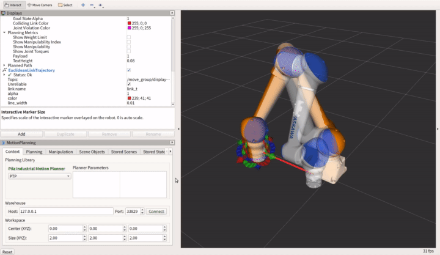
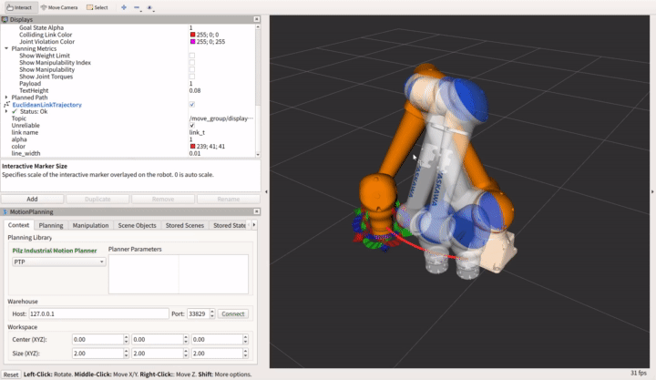
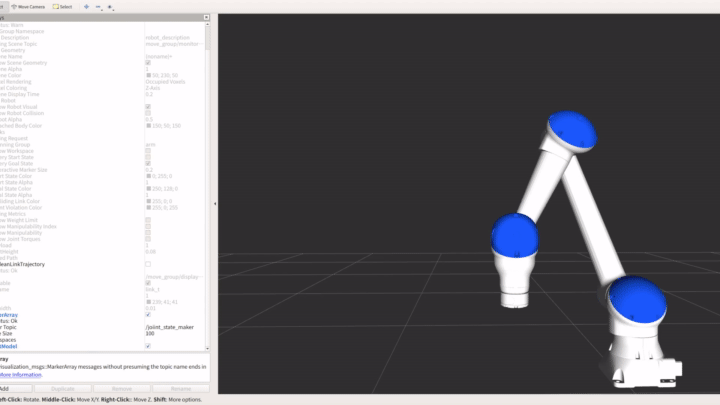
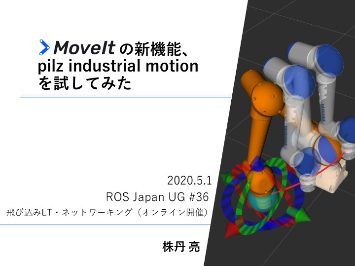

# test_pilz_industrial_motion
pilz industrial motion plannerのテスト

## ビルド
2020/5/1時点ではマージされていないため、以下のコマンドで必要なパッケージと手動で取得する。
以下のコマンドを実行する前に、このプルリクの進捗は見たほうがよい。
https://github.com/ros-planning/moveit/pull/1893

```bash
git clone https://github.com/PilzDE/moveit.git
cd moveit
git checkout -b pilz_planner_merge origin/pilz_planner_merge
cd ..
git clone https://github.com/PilzDE/pilz_industrial_motion.git
cd pilz_industrial_motion
git checkout -b moveit_merge origin/moveit_merge
cd ..
git clone https://github.com/PilzDE/pilz_robots.git
cd pilz_robots
git checkout -b moveit_merge origin/moveit_merge
cd ..
git clone https://github.com/PilzDE/moveit_msgs.git
cd moveit_msgs
git checkout -b pilz_planner_merge origin/pilz_planner_merge
cd ../..
rosdep install -i -y -r --from-paths src
catkin build
```

## 実行方法
### demo.launch

ロボットは何でもよい。
ただし、`motoman_moveit_config_hc10/launch/pilz_industrial_motion_planner_planning_pipeline.launch.xml`
がきちんと指定できているかを確認する。
フォーマットは、
https://github.com/PilzDE/pilz_robots/blob/moveit_merge/prbt_moveit_config/launch/pilz_industrial_motion_planner_planning_pipeline.launch.xml
ここを参照する。

その他のconfigもここを参考にする。
https://github.com/PilzDE/pilz_robots/tree/moveit_merge/prbt_moveit_config

```bash
roslaunch motoman_moveit_config_hc10 demo.launch
```

#### PTP



#### LIN



### 軌道の確認
`MotionSequenceRequest`型での動作確認。

```bash
rosrun test_motion_sequence motion_sequence_request.py
```

JointStatesの情報からの手先座標可視化

```bash
rosrun motoman_viz forward_kinetics_solver_joint_state 
```



## 参考資料

[](https://www.slideshare.net/RyoKabutan/moveit-pilz-industrial-motion)

https://www.slideshare.net/RyoKabutan/moveit-pilz-industrial-motion

### その他参考資料

* https://github.com/ros-planning/moveit/pull/1893
* https://github.com/PilzDE/moveit_tutorials/blob/trapezoidal_planner/doc/trapezoidal_industrial_planner/trapezoidal_industrial_planner.rst
* https://github.com/Nishida-Lab/motoman_project (コードを一部移植。)